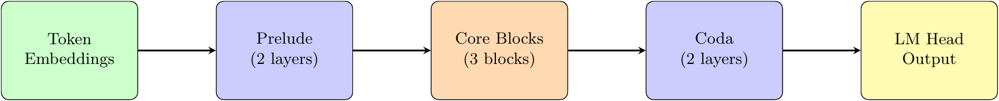
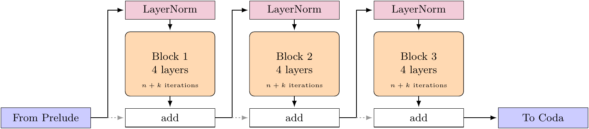
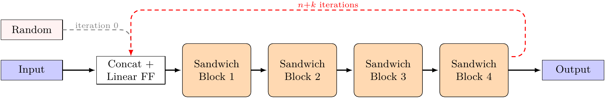
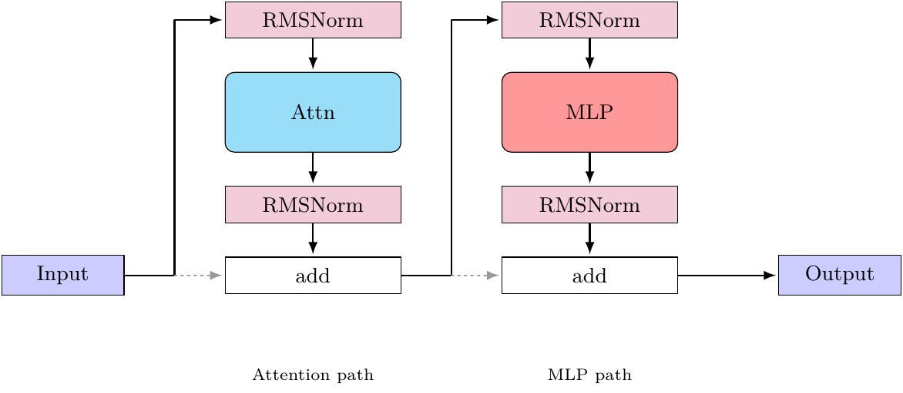
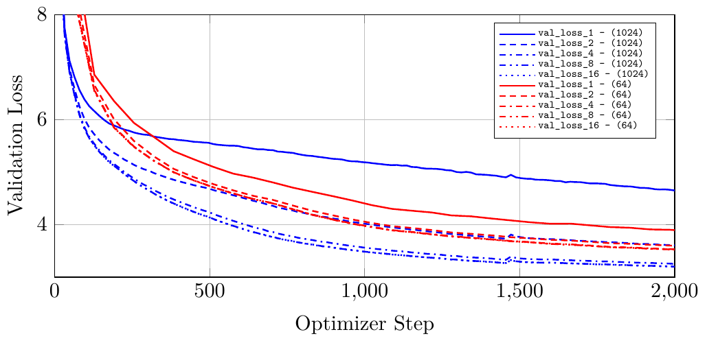

# Multiblock Recurrent Transformer

This repository contains the code for my thesis "Efficient Large Language Models via Recurrent Transformer Blocks" (PDF available [here](https://github.com/KT313/papers/blob/main/efficient_large_language_models.pdf)). 

> **Built on [seal-rg/recurrent-pretraining](https://github.com/seal-rg/recurrent-pretraining)** (Geiping et al., 2025, Apache-2.0), base commit `3055b7f`. This repo is a multi-block extension of their depth-recurrent transformer; see `git diff upstream-base..HEAD` for exactly what was changed.


## Work

The original repo trains one recurrent block between a "prelude" and a "coda" block. This fork generalizes that to N core blocks, each with its own injection adapter, output norm, mean recurrence and truncated-backprop depth (`model/recurrent_gpt.py`, config in `model/config.py` + `model/presets.py`).
Besides the architecture change, I added the following:
- 3-staged training with smooth data/LR transitions (`training/stage_manager.py`, `docs/multistage_training.md`)
- a compact single-GPU training loop with checkpoint/resume and dataset mixing (`training/train.py`; distributed training is meant to be re-added behind `training/backend/`)
- HuggingFace export path (`model/hf.py`)
- dataset preparation driven by a dataset config (`config/datasets/`, `data_preparation/`): sources, budgets, mixtures and tokenizer in one YAML, built incrementally and verified before training

The code was restructured and trimmed after the thesis: only the code path of the final run survives, with tests next to every module. The thesis-era tree (SLURM tooling, all upstream model variants) is in git history up to tag `v1.0`.

## Usage

```bash
uv sync --all-extras                                        # environment (uv only)
uv run pytest                                               # tests, CPU, < 1 min
uv run python training/train.py --config config/tiny.yaml   # 20-step smoke run on synthetic data (built on the fly)
uv run python training/train.py --config config/crow_300m_final.yaml   # the thesis run on one GPU
```

A run config (`config/<run>.yaml`) holds model, optimizer, LR and batch settings and points to a dataset config
(`config/datasets/<name>.yaml`) that defines sources, per-stage token budgets/mixtures and the tokenizer. Training
verifies the prepared data under `dataset/` and builds what is missing (`auto_prepare: true`); to prepare up front
or inspect the plan:

```bash
uv run python data_preparation/prepare.py build  --dataset_config config/datasets/crow_300m_final.yaml   # export HF_TOKEN for gated sources
uv run python data_preparation/prepare.py status --dataset_config config/datasets/crow_300m_final.yaml
uv run python data_preparation/prepare.py build  --dataset_config config/datasets/crow_300m_mini.yaml    # same sources, a few MB: real-source smoke build
```

`crow_300m_mini.yaml` is the thesis config with tiny budgets — it touches every real source (minutes, a few MB) and
is the quickest way to check that the data path works end to end; `tools/capped_download.sh 500 <command>` runs any
command under a hard download cap (see `tools/README.md`).

See `data_preparation/README.md` for the dataset config, `docs/data_mixture.md` for the thesis mixture (generated
from the config) and `docs/multistage_training.md` for the stage mechanism.

```
model/             architecture (RecurrentGPT, config + presets, HF export)
training/          train.py, settings, backend/, data/ (streaming, collation, dataset resolver), optimizer, schedule
data_preparation/  prepare.py (build / status / describe / tiny) + lib/
config/            run configs; config/datasets/ dataset configs
dataset/           gitignored; prepared data, instruct mixtures and tokenizers
docs/              thesis documentation and figures
tools/             dev tooling (download-capped command runner)
```

Final model configs in the original repo were named "raven", so I named my model configs "crow" in the same spirit.

## Architecture

### Overview


### Core Blocks


### Recurrent Block


### Sandwich Block


## Results

Training was stable across all three phases at 308M parameters / ~5B tokens. Due to resource limitations, the model is very undertrained, and as expected, benchmark scores are around the same performance as random guessing (raw numbers are in the thesis PDF).  
It is expected that, with the same number of optimizer steps, the model with higher batch size per step would perform better.  
Interestingly, the world batch size seems to directly affect the quality impact of recurrent step settings.
Compared to world batch size 64, world batch size 1024 strongly increases the loss for a single iteration of the recurrent blocks (unexpected), while decreasing the loss significantly for higher numbers of recurrent iterations (expected).


*Comparison between a training run with batch size 1024 (blue) and batch size 64 (red) and different numbers of recurrent steps (1-16) for each.*

## Note

During all training runs for my thesis, one of the two prelude blocks in my models never received a gradient during training. This was caused by the prelude blocks not chaining correctly in a for-loop. The issue has since been fixed in the code (commit "Fix prelude layers not chaining in model_dynamic forward").

## Training Info

- 3 days on 4×A100 80GB (DDP, bf16-mixed) via SLURM on a university cluster
- ELLISAdam optimizer (following original repo)
- world batch 1024
- sequence length 2048 tokens

## Citation

```bibtex
@article{geiping2025scaling,
  title   = {Scaling up Test-Time Compute with Latent Reasoning: A Recurrent Depth Approach},
  author  = {Geiping, Jonas and McLeish, Sean and Jain, Neel and Kirchenbauer, John and Singh, Siddharth and Bartoldson, Brian R. and Kailkhura, Bhavya and Bhatele, Abhinav and Goldstein, Tom},
  journal = {arXiv preprint arXiv:2502.05171},
  year    = {2025}
}

@thesis{kerner2025recurrent,
  title  = {Efficient Large Language Models via Recurrent Transformer Blocks},
  author = {Kerner, Tobias},
  school = {Technische Hochschule Ingolstadt},
  type   = {Bachelor's thesis},
  year   = {2025}
}
```