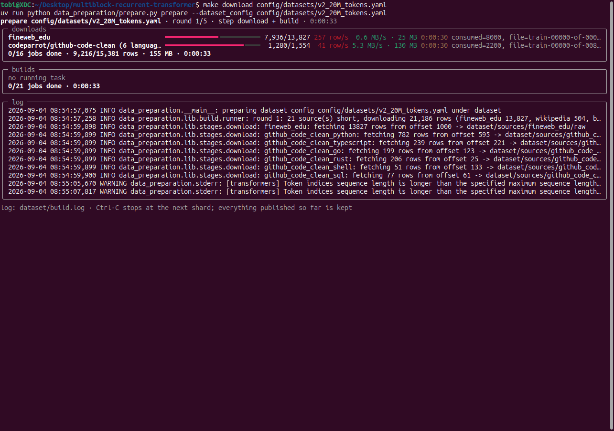
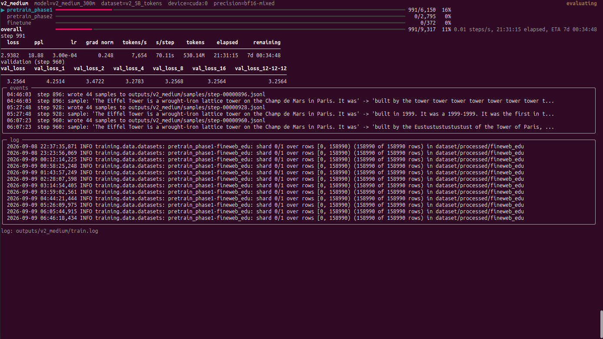

# Multiblock Recurrent Transformer

A multi-block depth-recurrent transformer with dataset preparation, training, evaluation, and Hugging Face export. The architecture is described in the thesis [Efficient Large Language Models via Recurrent Transformer Blocks](https://github.com/KT313/papers/blob/main/efficient_large_language_models.pdf).

> **Built on [seal-rg/recurrent-pretraining](https://github.com/seal-rg/recurrent-pretraining)** (Geiping et al., 2025, Apache-2.0).

## Features

The model has N recurrent core blocks between prelude and coda blocks. Each core has its own injection adapter, input norm, mean recurrence and truncated-backprop depth (`model/model.py`, config in `model/config.py`, architectures in `config/model_architecture/`).

The repository also provides:

- 3-staged training with smooth data/LR transitions (`training/stage_manager.py`, `docs/multistage_training.md`)
- a compact training loop with checkpoint/resume and dataset mixing (`training/run.py:train()`, the CLI `training/train.py`), on one GPU or on every GPU of one machine (`backend: ddp` under torchrun, `docs/distributed_training.md`)
- HuggingFace export path (`model/hf/modeling.py`)
- dataset preparation driven by a dataset config (`config/datasets/`, `data_preparation/`): sources, stages with token budgets and weights, and the tokenizer in one YAML; downloaded and built incrementally and verified before training

## Usage

### Setup

```bash
make setup                # prepare uv venv
uv run hf auth login      # log into huggingface for gated datasets

make test                 # tests
make typecheck            # mypy, basedpyright
make lint                 # ruff
```

### Configs

- `config/<run>.yaml`: Optimizer, LR, batch settings, reference to model architecture and dataset configs (`model_overwrite` overrides single architecture keys)
- `config/model_architecture/<name>.yaml`: model architecture settings
- `config/datasets/<name>.yaml`: dataset composition

### Data Preparation

Optional: training builds whatever is missing itself by default (`auto_prepare: true`). Gated sources need the huggingface login from Setup.

```bash
# mini smoke run (real sources, a few MB)
uv run python data_preparation/prepare.py prepare  --dataset_config config/datasets/crow_300m_mini.yaml

# download and build the configured data sources
uv run python data_preparation/prepare.py prepare  --dataset_config config/datasets/crow_300m_final.yaml

# download only (tokenizer + raw shards), build later with prepare
uv run python data_preparation/prepare.py download --dataset_config config/datasets/crow_300m_final.yaml

# check which sources are missing locally without starting download
uv run python data_preparation/prepare.py status --dataset_config config/datasets/crow_300m_final.yaml

# make shortcuts for the same: prepare / download / status
make prepare config/datasets/crow_300m_final.yaml
make download config/datasets/crow_300m_final.yaml
make status config/datasets/crow_300m_final.yaml
```



### Training

```bash
# mini smoke run with synthetic data
uv run python training/train.py --config config/tiny.yaml
TRAINING_DASHBOARD=0 uv run python training/train.py --config config/tiny.yaml # TUI disabled
DASHBOARD_SHOW_MICRO_BATCHES=1 uv run python training/train.py --config config/tiny.yaml # TUI with a micro-batch bar per optimizer step

# train a configured model
uv run python training/train.py --config config/crow_300m_final.yaml

# make shortcut for the same
make training config/crow_300m_final.yaml

# all GPUs of this machine (the config sets backend: ddp; see docs/distributed_training.md)
make training-ddp config/crow_300m_final.yaml          # GPUS=2 for a subset
```



Training packs documents end to end: one row of `tokens_per_micro_batch` tokens per micro-batch,
`micro_batches_per_step` of them per optimizer step, attention masked per document.
Validation runs on padded rows, `validation_batch_size` per forward.

`use_custom_kernels: true` (default) enables the CUDA MLP, LM-head loss and RoPE/QKV kernels from
[`model/kernels/`](model/kernels/README.md) with strict loading and input checks. Set it to `false` for native operations;
it is independent of `compile_model` and `gradient_checkpointing`. Missing dependencies, CPU/unsupported inputs,
and kernel failures raise an explanatory error with that setting; there is no automatic native retry.
The setting is saved in model/Hugging Face configs. On resume, changing it follows the existing
`allow_settings_change` policy; older checkpoints without the flag represent native execution.

Resuming skips fresh weight initialization and restores the saved model, optimizer and RNG states.
With `resume: true` and no checkpoint, training starts fresh only if the run directory has no prior run evidence.
Otherwise, choose a new run name or a valid checkpoint; see [resume behavior](docs/resume_configuration_history.md).

Basic metrics follow `log_step_interval`; expensive per-parameter gradient/update statistics follow
`log_gradient_metrics_interval` independently. Both count completed optimizer steps. The gradient interval must be
an integer >= 0: `0` disables those statistics; a positive value must be a multiple of `log_step_interval`.
For cheap metrics every step and gradient statistics every eighth step:

```yaml
log_step_interval: 1
log_gradient_metrics_interval: 8
```

The default gradient interval is `1`. The scalar `grad_norm` is part of basic logging because clipping
already computes it. Logging cadence can change on resume without affecting training state.

A run resumes by default (`resume: true`): the most recently written checkpoint of `run_name` in its run directory is
loaded, or `resume_checkpoint_path` names one; a checkpoint written with other settings, model config or dataset config
is refused unless `allow_settings_change` / `allow_dataset_change` say so. `compile_model: true` compiles the model with
`torch.compile`. The architecture's `bf16_residual_stream` (`none`, `core`, `all`) decides which RMSNorm outputs are
rounded to the autocast dtype under bf16-mixed precision: none, the core blocks' (the recurrence runs on a bf16 stream),
or every norm's.

### Evaluation

Sample generations and lm-eval-harness scores (`evaluation/`), on a checkpoint or during training:

```bash
uv sync                  # installs training, data preparation, evaluation, and development dependencies

# greedy samples for the built-in prompts; --tasks adds benchmarks
uv run python evaluation/evaluate.py --checkpoint outputs/<run>/checkpoints/<file>.pth
uv run python evaluation/evaluate.py --checkpoint <file>.pth --tasks arc_challenge,hellaswag --limit 200

# make shortcut (EVAL_TASKS=a,b for benchmarks)
make evaluate outputs/<run>/checkpoints/<file>.pth
```

During training the run config decides when they run: every `sample_step_interval` steps and after the steps at
the percentages of the run in `sample_at_training_progress` (0: after the first step, 100: after the last;
default `[100]`), combined; `benchmark_step_interval` and `benchmark_at_training_progress` (default: off) likewise.
The percentages become step numbers once the stage plan is known; `train.log` lists them. Files land in
`outputs/<run>/samples/` and `outputs/<run>/benchmarks/`, named by step; scores also go to wandb as
`benchmark/<recurrence>/<task>/<metric>`. `sample_recurrences` and `benchmark_recurrences` list the recurrent
steps per block to run with, e.g. `[[4, 4, 4], [12, 12, 12]]` (empty: the mean recurrence once); the CLI takes
`--recurrence 4,4,4` repeatedly. Both run RNG-isolated, so they do not change the training.

Every scored context starts with a BOS token, as every training row does. Samples and scores can shift with
`batch_size`: each recurrent forward draws its initial latent state for the whole batch at once, so a row's noise
depends on the rows it is batched with and on how far they are padded.

## Architecture

### Overview


### Core Blocks


### Recurrent Block


### Sandwich Block


## Citation

```bibtex
@article{geiping2025scaling,
  title   = {Scaling up Test-Time Compute with Latent Reasoning: A Recurrent Depth Approach},
  author  = {Geiping, Jonas and McLeish, Sean and Jain, Neel and Kirchenbauer, John and Singh, Siddharth and Bartoldson, Brian R. and Kailkhura, Bhavya and Bhatele, Abhinav and Goldstein, Tom},
  journal = {arXiv preprint arXiv:2502.05171},
  year    = {2025}
}

@thesis{kerner2025recurrent,
  title  = {Efficient Large Language Models via Recurrent Transformer Blocks},
  author = {Kerner, Tobias},
  school = {Technische Hochschule Ingolstadt},
  type   = {Bachelor's thesis},
  year   = {2025}
}
```
