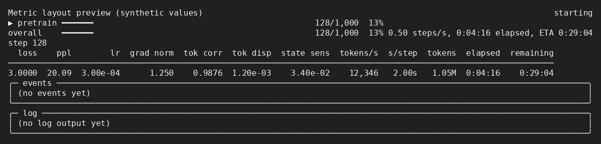

# Representation and state metrics during training

`log_gradient_metrics_interval` triggers representation/state diagnostics together with gradient statistics,
after the optimizer update and before gradient clearing. Zero disables both. The optional selector below is
recorded with run settings. The helpers are in `training/representation_metrics.py`.

## Selecting detailed correlations

Use the string setting `log_correlations` in YAML or on the CLI:

```yaml
log_gradient_metrics_interval: 4
log_correlations: "adapter,attention,mlp"
```

```bash
uv run --no-sync python training/train.py --config config/tiny.yaml --log_correlations "attention,mlp"
```

| Value | Detailed correlations calculated and logged |
|---|---|
| Omitted, `null`, or `""` | None |
| `"adapter"` | Adapter input streams, merged output, following core output |
| `"attention"` | Attention-module input/output in every sandwich layer of every core |
| `"mlp"` | MLP-module input/output in every sandwich layer of every core |
| `"adapter,attention,mlp"` | All of the above |

Any subset is supported. Whitespace/case are normalized and duplicate names removed; unknown names and booleans
are rejected. No detailed-correlation hooks or reductions run for unselected components. These selections apply
at `log_gradient_metrics_interval`; zero still disables the entire diagnostic cadence. The existing dashboard
summary metrics (`token_correlation`, `token_dispersion`, `state_sensitivity`) remain independent of this detailed
selector. It can be changed on resume, including for older checkpoints where the field is absent, without
`allow_settings_change`: it does not change the training objective or optimizer state.

## Dashboard and W&B



The live dashboard and fallback/log-file line place three values between **grad norm** and **tokens/s**:

| Dashboard | Metric key | Meaning |
|---|---|---|
| tok corr | `token_correlation` | Mean centered similarity between different token positions before the vocabulary head |
| tok disp | `token_dispersion` | Token dispersion before the vocabulary head |
| state sens | `state_sensitivity` | Minimum normalized next-output sensitivity across recurrent cores |

Columns appear after the first measurement. The live display retains the latest values between measurements;
W&B, history and log-file lines receive new values only at their actual measurement steps. Undefined values show
`n/a` on the dashboard and NaN in numerical logs, with accompanying degeneracy/count metrics.

Additional W&B keys retain detail:

- `representation/{prelude,core_0,...,pre_head}/{correlation,cosine,dispersion,rms}`
- Under the same prefixes: `tokens`, `sampled_tokens`, `correlation_pairs`, `cosine_pairs`,
  `zero_vector_fraction`, `zero_variance_fraction`, `nonfinite_fraction`, `same_token_pair_fraction`.
- `recurrence/core_<i>/{depth,state_sensitivity,state_perturbation,output_response}`.
- With `adapter` selected: `adapter/core_<i>/iter_<r>/{block_input,state_input,merged_output,core_output}/correlation`, for **every**
  executed probe iteration (1 through the recorded per-core depth, capped at 8). `block_input` is the normalized
  previous-block stream; `state_input` is the random initial state at iteration 1 or the previous iteration's
  output thereafter; `merged_output` is the actual tensor entering the first core layer; `core_output` is the
  tensor leaving the last core layer. These are correlations between token positions within each stream, not
  correlations between the two streams.
- Under those adapter prefixes: `correlation_pairs`, `sampled_tokens`, `sampled_zero_variance_fraction` and
  `sampled_nonfinite_fraction`. They describe the bounded correlation sample, not every token in the document.
- With `attention` selected: `attention/core_<i>/iter_<r>/layer_<l>/{input,output}/correlation`.
  `input` is the output of `norm_1`, entering the attention module. `output` is the attention branch's projected
  output **before** residual addition and `norm_2`. These are hidden-vector correlations, not attention-score
  or attention-probability statistics.
- With `mlp` selected: `mlp/core_<i>/iter_<r>/layer_<l>/{input,output}/correlation`.
  `input` is the output of `norm_3`; `output` is the MLP branch output **before** residual addition and `norm_4`.
  Both families include the same sample-count/degeneracy fields as adapters. Core/layer indices are zero-based;
  iteration indices are one-based. Only sandwich layers inside recurrent cores are instrumented.
- `recurrence_probe/{version,available,tokens,seed,rank,step}`. The current probe version is 3; `step` is the
  completed-step number of the probe.
- `recurrence_probe/residual_scale`: the fixed sandwich-branch coefficient (1 when scaling is disabled).
  Attention/MLP hooks observe raw module outputs before this multiplication; later representations include it.

The displayed training loss comes from the earlier training forward; these probe activations use post-update
weights. On the deliberately skipped first optimizer update, they describe the unchanged initial weights.

## What is probed

The probe selects the longest supervised document in **rank zero's last microbatch**, breaking ties by first
occurrence, then takes its prefix up to `min(model_max_sequence_length, 2048)` positions. Actual local document IDs
and labels determine boundaries; rank-zero DDP composition metadata describes all ranks and must not be used
to select local positions. Padding tails are excluded. Masked instruction/prompt tokens remain input context.

This is a small, length-biased sample of changing training data, **not fixed validation data** and not the
actual activations of the differentiated training forward. A separate no-grad/eval forward uses the updated
weights, actual prelude/core/coda modules, configured precision and residual-stream dtype, and causal SDPA for
one isolated document. Enabled custom RoPE/MLP kernels retain their configured implementation. The vocabulary
projection is unnecessary and is not called.

Each core runs `min(mean_recurrence[i], 8)` iterations, recorded in `recurrence/core_<i>/depth`. Recurrence follows
the model's multi-core structure: normalize/reinject each core's input, carry its state between iterations, then
add its final state to the input before the next core. Initial states use a private generator seeded with 233;
perturbations use a separate private generator seeded with 234. The training depth sampler is not called.

Only rank zero performs this extra forward, directly on the unwrapped model with no DDP collectives. Other ranks
still execute their normal optimizer-step synchronization. Metrics describe rank zero's selected document, not
a distributed or dataset-wide average.

## Representation definitions

`representation_metrics(hidden, valid_mask=None, token_ids=None)` accepts **one document** shaped `[token, hidden]`.
Call separately for different packed documents/sequences. Supplying a batch dimension is rejected to prevent
accidental pooling across documents. The optional boolean mask excludes padding; ignored *target* labels must
not be used as an input mask, since prompt context remains valid.

All summaries use detached FP32 values. With valid token vectors h_t:

- **RMS:** `sqrt(mean(h_t²))` over all valid tokens/features.
- **Dispersion:** `sum_t ||h_t - mean_tokens(h)||² / sum_t ||h_t||²`. Zero total energy gives NaN.
- **Cosine:** normalize each sampled token by its hidden-vector L2 norm, then average dot products over distinct
  token positions. Zero vectors are excluded from this average and explicitly counted.
- **Correlation:** first center *each token vector over its hidden features*, normalize it, then average distinct
  token-pair dot products. Zero hidden-variance vectors are excluded and explicitly counted.

RMS/dispersion use all valid positions. Similarities sample at most 64 evenly spaced valid positions, retaining
repeated token IDs. `same_token_pair_fraction` reports the fraction of sampled pairs sharing a token ID. The mean
uses `||sum u||² - sum ||u||²`, divided by `n(n-1)`, which removes self-pairs without building a quadratic matrix.
There are at most 2016 distinct pairs. `sampled_correlation_metrics` uses the same sample and correlation formula
for the per-iteration values, gathering at most 64 positions before copying to CPU. This avoids transferring full
activations for every intermediate point. The normalized previous-block input is constant within a core and its
correlation is computed once, then repeated under each iteration's key. This deterministic sample is not an unbiased random-pair estimator. Less
than two nondegenerate vectors yields NaN and zero valid pairs. Nonfinite activations produce NaN summaries and
an explicit nonfinite fraction rather than being silently discarded.

This is a documented diagnostic definition, **not a claim to exactly reproduce the paper's Figure 5 metric**.
Persistent high similarity together with low dispersion and stalled loss supports representation contraction;
high similarity alone does not establish identical token vectors. RMS can remain normal during contraction.

## State sensitivity definition

At the final diagnostic iteration of each core, keep weights, injected input e, positions and attention mask
fixed. Let its incoming state be s and its normal next output be R(s,e). Add independent feature noise of 1% of
each token's RMS, renormalize each token to its original RMS, and cast back to the state dtype to obtain s'.
One additional no-grad core application computes R(s',e). The alternative output never enters the continuing
normal trajectory.

`state_sensitivity_metrics(s, s', R(s,e), R(s',e))` reports:

```
state_perturbation = ||s' - s|| / ||s||
output_response   = ||R(s', e) - R(s, e)|| / ||R(s, e)||
state_sensitivity = output_response / state_perturbation
```

Norms are FP32 over the whole selected document. Crucially, the denominator uses the *actual* perturbation after
norm matching and dtype rounding. Zero state/output norm or an ineffective perturbation gives NaN. The dashboard
shows the minimum sensitivity over cores; the per-core values remain in W&B. NaNs propagate to that minimum.

Low sensitivity may indicate state ignoring, local contraction or saturation. These perturbations can be
off-trajectory. High sensitivity demonstrates dependence, **not useful computation**. Interpret these values
alongside fixed-data recurrence-gain evaluations and loss trajectories. Flat depth curves or degenerate greedy
text early in training are not standalone diagnoses. Convergence from different initial states is not state
ignoring. No automatic collapse/state-ignoring alarm or threshold is applied.

## Isolation and cost

The helper is outside Dynamo compilation and uses no training-forward hooks. On measurement steps, rank zero
retains only the last pack's small input tensors, not training activation graphs. Other ranks and disabled/off-grid
steps retain no probe batch. Module training flags, CPU/current-device RNG and existing
gradients are preserved, including on exceptions. Private generators avoid seeding other CUDA devices. Optimizer
state, parameters, model step and microbatch index are not modified by the probe. There is no diagnostic backward.
Selected components are observed only during each normal **eager probe** iteration. An adapter pre-hook observes
the first core layer's input; attention/MLP hooks observe the corresponding submodule's input and output. All
temporary hooks are removed in a `finally` block before perturbation passes and before training resumes,
preserving pre-existing hooks. They do not instrument the compiled training forward or change its kernel policy.

Cost at each interval is one document forward through prelude/coda and up to eight iterations per core, plus one
extra core iteration per core for sensitivity, and bounded FP32 summaries. It is included in measured step time,
like existing gradient-statistics overhead. Selected per-iteration correlations add sampled reductions/transfers,
but no additional core forward calls or GEMMs. Attention/MLP selection scales with the physical layer count and
produces more logged series than adapter-only selection. CUDA custom kernels may compile a new sequence-shape specialization
on first use. Longer-context or late-depth failures require separate measurements beyond this bounded probe.

The metric functions do not write input tensors or retain autograd graphs. The probe temporarily sets eval flags
and installs observer hooks, restoring them on success and failure. It assumes forwards have no running-statistic
updates or other persistent side effects and receives no generation cache.
